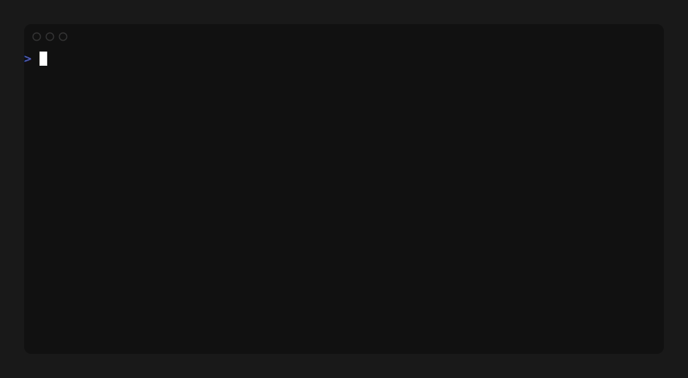

<div align="center">

```
 ██████╗  ██████╗ ██████╗  ██████╗ ███████╗██████╗
 ██╔══██╗██╔═══██╗██╔══██╗██╔════╝ ██╔════╝██╔══██╗
 ██╔══██╗██║   ██║██████╔╝██║  ███╗█████╗  ██║  ██║
 ██╔══██╗██║   ██║██╔══██╗██║   ██║██╔══╝  ██║  ██║
 ██████╔╝╚██████╔╝██║  ██║╚██████╔╝███████╗██████╔╝
 ╚═════╝  ╚═════╝ ╚═╝  ╚═╝ ╚═════╝ ╚══════╝╚═════╝
```

**forge Android kernels with one command**

`mrproper → defconfig → clang → AnyKernel3 zip`

[](https://github.com/vxyzview/forged/actions/workflows/ci.yml)
[](https://github.com/vxyzview/forged/actions/workflows/release.yml)
[](https://go.dev)[](https://llvm.org)
[](https://github.com/charmbracelet/bubbletea)
[](https://github.com/spf13/cobra)
[](https://github.com/osm0sis/AnyKernel3)
[](https://github.com/vxyzview/forged/actions/workflows/release.yml)
[](https://github.com/vxyzview/forged/releases/latest)
[](#install)
[](LICENSE)

[Install](#install) · [Quick start](#quick-start) · [CLI](#cli) · [Config](#config) · [Toolchains](#toolchains) · [CI/CD](docs/ci-cd.md) · [Windows / macOS](docs/windows-macos.md) · [FAQ](#faq)

</div>

```text
$ forged build

  ▌ FORGE
 ──────────────────────────────────────────
  ✓ mrproper      1.2s
  ✓ defconfig     0.4s
  ● build         ████████░░░░░░░░  12m31s
    CC      drivers/gpio/gpio-x.o
    CC      drivers/clk/qcom/clk-rpmh.o
    LD      vmlinux.o

  ✓ packaged   Forged-v1.0-20260907-183001.zip  (34.2 MiB)  →  releases/
```

---

## Why

Kernel building is a multi-step, copy-paste-from-Telegram ritual that breaks the moment you blink. forged collapses it into one command — live TUI, scrolling log, forge-fire colors — and packages a flashable AnyKernel3 ZIP when the smoke clears.

One static binary. No interpreter, no runtime, no GCC.

**The pipeline**

| Phase | What forged does |
|---|---|
| `mrproper` | Deep-clean the kernel tree (`O=` build dir respected) |
| `defconfig` | Generate `.config` from your defconfig |
| `build` | Compile with Clang + LLVM binutils, `-j` auto-tuned |
| `package` | Stage kernel + DTB + modules, render `anykernel.sh`, zip it |

**What you get**

- **Live Bubble Tea TUI** — progress bars, phase headers, colourised compiler output, per-step timing. Falls back to plain streaming logs when piped or in CI, so builds never break headless.
- **LLVM-only toolchain** — AOSP prebuilt Clang or system Clang. GNU binutils (`ld`, `ar`, `nm`, `objcopy`, `objdump`, `readelf`, `strip`) are all replaced with their LLVM twins. Zero GCC.
- **ccache, tuned for kernels** — kernel-safe sloppiness flags pre-configured, `--ccache` / `--no-ccache` CLI overrides, a stats command. Rebuilds drop **60–90%**.
- **Auto toolchain setup** — `forged setup-toolchain` downloads AOSP Clang via aria2 (16-connection, net/http fallback), validates cross-compilers, and can install them for you.
- **Flexible sources** — kernel tree from a local dir or any git URL; AnyKernel3 staging from upstream, your fork, a local checkout, or a stub.
- **Windows/macOS-friendly** — WSL2 walkthrough for Windows, ready-made Docker image for macOS — plus native binaries for configs and SSH workflows.
- **Portable configs** — TOML or JSON, forward-compatible (unknown keys from newer versions are ignored), interactive wizard included.
- **LTO aware** — `thin` / `full`, transparent alongside ccache ≥ 4.0.
- **Issues log** — every build writes an errors + warnings digest under `out/logs/`, so you never scroll the TUI for that one warning again.

---

## Install

```bash
curl -fsSL https://raw.githubusercontent.com/vxyzview/forged/main/install.sh | bash
```

The installer detects your platform, downloads the matching binary from
[Releases](https://github.com/vxyzview/forged/releases/latest), verifies the
SHA-256 checksum, and installs to `/usr/local/bin` (or `~/.local/bin`).

| | | |
|---|---|---|
| **Linux** | x86_64 · arm64 · x86 · armv7 | full builds — native |
| **Windows** | x86_64 · arm64 | [**WSL2**](docs/windows-macos.md) for builds · config / SSH workflows natively |
| **macOS** | Apple Silicon · Intel | [**Docker**](docs/windows-macos.md) for builds · config / SSH workflows natively |

Pin a version with `FORGED_VERSION=v1.0.5` or
`curl … | bash -s -- --version v1.0.5`.

Windows users: run the installer **inside WSL2** (Ubuntu) — running it in Git
Bash / MSYS prints the WSL2 setup steps instead. See
[`docs/windows-macos.md`](docs/windows-macos.md).

Or with Go (requires Go 1.27+):

```bash
go install github.com/vxyzview/forged/cmd/forged@latest
```

Shell completions: `forged completion bash | sudo tee /etc/bash_completion.d/forged`
(also available for `zsh`, `fish`, `powershell`).

Or with Docker — a ready Ubuntu image with Clang/LLVM, kbuild tools, cross-compilers, ccache and aria2 preinstalled:

```bash
docker build -t forged https://github.com/vxyzview/forged.git
docker run --rm -it -v "$PWD/my-kernel":/work -w /work forged
```

> [!NOTE]
> Kernel builds need Linux. That's a given on Linux; on Windows use **WSL2** and on macOS use the **Docker** image — see [`docs/windows-macos.md`](docs/windows-macos.md) for the walk-through. The native macOS/Windows binaries handle configs, source management, and SSH workflows against a remote Linux box (the wizard auto-switches to `system-clang` there and prints the right install hint).

---

<div align="center">



</div>

---

## Quick start

```bash
forged setup-toolchain          # fetch AOSP Clang — first time only
forged build --wizard           # wizard writes your config, then the forge lights up
```

Flash the ZIP that lands in `releases/`.

Day two — incremental rebuild with cache:

```bash
forged build -c build_config.toml --no-clean --ccache
```

From a git-hosted kernel tree, no local source needed:

```bash
forged build --source-url https://github.com/you/kernel.git \
             --source-branch android-15 \
             -d vendor/your_device_defconfig
```

---

## CLI

**`forged build`**

| | |
|---|---|
| `-c, --config PATH` | JSON or TOML build config |
| `-w, --wizard` | Interactive setup wizard |
| `-s, --source DIR` | Kernel source directory |
| `--source-url URL` | Clone the kernel source first |
| `--source-branch BRANCH` | Branch / tag for `--source-url` |
| `--source-depth N` | `1` = shallow (default), `0` = full history |
| `-d, --defconfig NAME` | Defconfig |
| `-j, --jobs N` | Parallel jobs (`0` = auto) |
| `--no-clean` | Skip `mrproper` |
| `--no-package` | Skip the ZIP |
| `--version-tag TAG` | Tag on the output ZIP name |
| `--anykernel-dir DIR` | AnyKernel3 staging directory |
| `--anykernel-source MODE` | `osm0sis` / `git` / `local` / `stub` |
| `--log-file PATH` | Errors + warnings digest destination |
| `-F, --make-flag VAR=VALUE` | Append a make variable (repeatable) |
| `-E, --env KEY=VALUE` | Inject an env var (repeatable) |
| `--ccache` / `--no-ccache` | Toggle ccache |
| `--ci` | CI mode: no prompts, collapsible log groups, error annotations, outputs + report (auto-on in any detected CI) |
| `--toolchain-dir DIR` | Where auto-downloaded toolchains live (cache-friendly) |
| `--toolchain-extra-path DIR` | Pre-provisioned clang location, skips auto-download (repeatable) |
| `--arch ARCH` | `arm64` (default) / `arm` / `x86_64` |

**Every CI/CD system, one flag.** `--ci` (or just being inside CI — forged detects it) means no interactive prompts, git clones that fail fast instead of hanging, and a machine-readable build report:

| Environment | What forged emits |
|---|---|
| GitHub Actions | `::group::` collapsible steps, `::error`/`::warning` annotations, `zip_path`/`outcome` outputs, Markdown job summary |
| GitLab CI | `section_start`/`section_end` collapsible sections, report in job log |
| Azure Pipelines | `##[group]` sections, `##vso[task.logissue]` errors/warnings |
| TeamCity | `blockOpened`/`blockClosed`, escaped service messages |
| Buildkite | `---` fold sections |
| Jenkins, CircleCI, Travis, Drone, Bitbucket, AppVeyor, Woodpecker, Cirrus, anything with `CI=true` | plain step banners (no vendor lock-in), report in log, `FORGED_CI=1` to force |

**`forged setup-toolchain`**

| | |
|---|---|
| `--preset PRESET` | `aosp-clang` (default) or `system-clang` |
| `--version VERSION` | AOSP Clang revision, e.g. `r584948b` |
| `--toolchain-dir DIR` | Storage path (default `~/.local/share/forged/toolchains`) |
| `--install-cross-compilers` | Auto-install GNU cross-compilers |

**`forged config`** — wizard, saves a config · **`forged info`** — print a config summary · **`forged ccache-stats`** — cache statistics, `--zero` to reset · **`forged doctor`** — verify the build environment (git, make, clang, LLVM binutils, cross-compilers, ccache, aria2, disk space) with fix hints for everything missing · **`forged completion bash|zsh|fish|powershell`** — shell completion scripts

---

## Config

```toml
kernel_source    = "/path/to/kernel/source"
kernel_defconfig = "vendor/your_device_defconfig"
arch             = "arm64"
jobs             = 0        # 0 = auto

# Sanity-check the environment before debugging anything else:
#   forged doctor

[toolchain]
preset             = "aosp-clang"
aosp_clang_version = "r584948b"
auto_clone         = true

[anykernel3]
source         = "osm0sis"       # osm0sis | git | local | stub
# repo_url     = "https://github.com/you/AnyKernel3-fork"   # git / local modes
# do_modules   = -1              # -1 auto (default) | 0 never | 1 always
kernel_name    = "Forged"
block          = "/dev/block/by-name/boot"
device_names   = ["your_device"]

[ccache]
enabled  = true
max_size = "5G"
```

Every field, annotated: [`config/example_build_config.toml`](config/example_build_config.toml) · same thing as [JSON](config/example_build_config.json).

---

## AnyKernel3 staging

| `source` | Where the staging tree comes from |
|---|---|
| `osm0sis` | Clones upstream [osm0sis/AnyKernel3](https://github.com/osm0sis/AnyKernel3) — default |
| `git` | Clones **your fork** — set `repo_url`, optional `repo_branch` |
| `local` | Copies an existing checkout — `repo_url` is the path |
| `stub` | Bare skeleton; ZIPs build but are **not flashable** |

forged never clobbers a populated checkout — it reuses (and `git pull`s) it, and re-renders `anykernel.sh` from your config on every build.

---

## Toolchains

| Preset | Source | Auto-download |
|---|---|---|
| `aosp-clang` | AOSP prebuilts | yes — linux-x86_64 only |
| `system-clang` | system `clang` | — |

All presets replace GNU binutils with LLVM:

| GNU | replaced by |
|---|---|
| `ld` | `ld.lld` |
| `ar` | `llvm-ar` |
| `nm` | `llvm-nm` |
| `objcopy` | `llvm-objcopy` |
| `objdump` | `llvm-objdump` |
| `readelf` | `llvm-readelf` |
| `strip` | `llvm-strip` |

**No GCC required.** Cross-compilers for arm64/arm targets:

```bash
forged setup-toolchain --install-cross-compilers
```

More in [`docs/toolchains.md`](docs/toolchains.md).

---

## FAQ

**Where do the ZIPs land?**
`releases/<kernel_name>-<timestamp>[-<version_tag>].zip`, next to your kernel tree.

**How do I skip the clean build?**
`--no-clean`. Keep ccache on and rebuilds are minutes, not hours.

**Can I inject extra make variables?**
`-F LLVM=1 -F KCFLAGS=-pipe` (repeatable). Env vars: `-E KBUILD_VERBOSE=1`.

**ccache + LTO together?**
Safe. Thin LTO needs ccache ≥ 4.0, full LTO ≥ 4.8. forged handles the passthrough.

**Where are the build errors?**
Every run writes an errors + warnings digest to `out/logs/` — grep-friendly, no TUI scrolling.

**Are my built modules actually installed?**
Yes — as of `do_modules = -1` (auto): when the build produces `.ko` files, forged sets AnyKernel3's `do.modules=1` so they land in `/system/lib/modules`. Force with `1`, disable with `0`.

**Is my host ready to build?**
`forged doctor` — checks git, make, clang, LLVM binutils, cross-compilers, ccache, aria2 and free disk space, printing a fix command for anything missing.

**Does it work on macOS / Windows?**
Yes — natively for configs, source management and SSH workflows; for actual builds use **WSL2** (Windows) or the repo's **Docker image** (macOS). Full guide: [`docs/windows-macos.md`](docs/windows-macos.md).

**Can I build my kernel on GitHub Actions?**
Yes — copy [`.github/workflows/build-kernel.yml`](.github/workflows/build-kernel.yml) into your kernel repo. It installs forged, caches AOSP Clang + ccache, runs `forged build --ci` and uploads the flashable ZIP as an artifact (and publishes a release on tags). The `--ci` flag disables all prompts and writes `zip_path` / `outcome` outputs plus a Markdown build report to the run summary.

**Other CI systems?**
The same `--ci` flag works everywhere — forged auto-detects GitLab CI, Azure Pipelines, Jenkins, CircleCI, Travis, Drone, Bitbucket Pipelines, AppVeyor, Buildkite, TeamCity, Woodpecker, Cirrus and generic `CI=true` environments, emitting each provider's native log groups and error annotations where supported. Set `FORGED_CI=1` to force it anywhere (cron, self-hosted scripts), `FORGED_CI_NO_PROMPT=1` to make git clones fail fast instead of prompting. Pipeline snippets for GitLab, Jenkins, Azure and CircleCI: [`docs/ci-cd.md`](docs/ci-cd.md).

---

## Project layout

```
forged/
├── cmd/forged/            # entry point
├── internal/
│   ├── banner/            # forge-fire ASCII art
│   ├── builder/           # make orchestration, env injection, step runner
│   ├── cienv/             # CI/CD provider detection + log dialects
│   ├── cli/               # cobra commands, build runner, CI plumbing
│   ├── config/            # BuildConfig, presets, JSON/TOML I/O
│   ├── packager/          # AnyKernel3 staging + ZIP creation
│   ├── toolchain/         # AOSP Clang download, git clone, cross-compilers
│   ├── tui/               # Bubble Tea live build monitor
│   └── wizard/            # huh-based interactive config wizard
├── config/                # annotated example configs (TOML + JSON)
├── docs/                  # toolchain, CI/CD + platform guides
├── Dockerfile             # ready-to-build Ubuntu image (Clang/LLVM + tools)
└── AnyKernel3/            # staging area (populated per-build)
```

Development:

```bash
go test ./...        # full suite
go vet ./...         # static checks
gofmt -l ./cmd ./internal
go build -o forged ./cmd/forged
```

---

## License

[MIT](LICENSE) — forged with love by [vxyzview](https://github.com/vxyzview).
